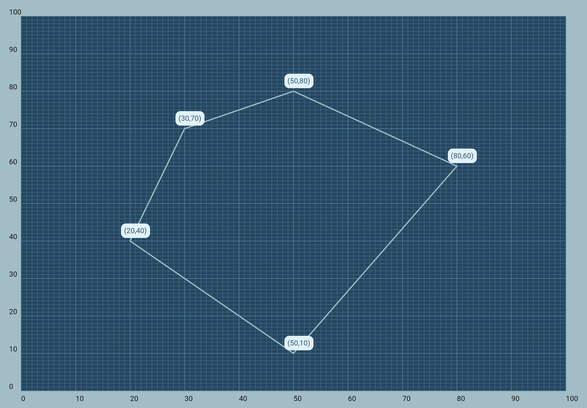

# Flutter Grid Plotter

## Overview
This Flutter application serves as a web app designed to dynamically display a grid where coordinates can be plotted. Users can input any number of coordinates, and the app will render these points on the grid, connecting them with lines in the order they were provided. Notably, the app automatically draws a line from the last coordinate back to the first, completing a loop.

## Features
- **Dynamic Coordinate Plotting**: Input any number of coordinates to see them plotted on the grid.
- **Automatic Line Drawing**: Points are connected in the order they are entered, with an automatic line connecting the last point to the first.
- **Responsive Grid Layout**: Optimized for web viewing, offering a clear and interactive grid layout.

## How to Use
1. **Input Coordinates**: Feed the desired coordinates into the grid component.
1. **View the Grid**: The app will dynamically plot these points and draw lines between them.
1. **Loop Completion**: A line is automatically drawn from the last to the first coordinate.

## Example
Below is an example of the grid plotter app in action. This illustrates how coordinates are plotted and connected on the grid.

